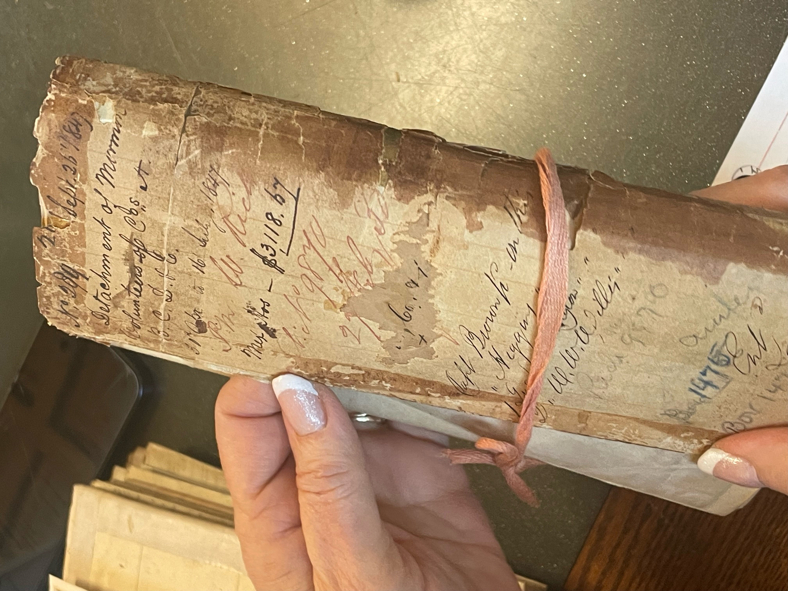

# mormon-battalion

https://www.battaliontrek.com/

This site is all about exploring the Mormon Battalion Trail, with information, maps, blogs, podcast and more!

Also accessable at https://mormon-battalion.vercel.app/

## Getting Started

Follow these steps to set up the project locally.

### Prerequisites

Make sure you have the following installed:

- [Git](https://git-scm.com/)
- A web browser (e.g., Chrome, Firefox)

### Installation

1. **Clone the repository**  
   Open a terminal and run:

   ```sh
   git clone https://github.com/ethyl2/mormon-battalion.git
   ```

2. **Navigate to the project folder**  

   ```sh
   cd mormon-battalion
   ```

3. **Open the project in a browser**  
   - If you are using a file-based approach, double-click `index.html` to open it.  
   - If you prefer using a local server, you can run:

     ```sh
     python -m http.server 8000  # For Python 3
     ```

     Then, open [http://localhost:8000](http://localhost:8000) in your browser.

    - Another approach is to install the VS Code extension [Live Server](https://marketplace.visualstudio.com/items?itemName=ritwickdey.LiveServer).
    Then you can right-click on the name of a HTML file in the left navigation and click on Open with Live Server.


### Adding Blog Posts

1. Create a blog post card in the Blog index page by copying and pasting an existing blog post card in blog.html, and then editing the relevant details.


```
<a href="./blog/2025-02-21-touching-the-past.html" class="group block w-full">
    <article class="border shadow rounded flex flex-col items-center justify-center space-y-2">
        
        <h3 class="text-lg font-bold text-gray-900 pt-4 px-4">Touching the Past!</h3>
        <p class="text-sm text-gray-700 px-4"><time datetime="2025-01-01">February 21, 2025</time></p>
        <p class="text-gray-800 text-sm line-clamp-2 px-4">
            We're at the National Archives this week and I got goosebumps when Laura Anderson held up this old bundle of documents and said they were records about the Detachments at Pueblo!       
        </p>
        <p class="text-blue-500 group-hover:text-blue-800 pb-4">Read More</p>
    </article>
</a>
```

2. Make a copy of the template.html or an existing file in the blog directory. Rename it and then change whatever you'd like!

4. One tool that can be handy is chatGpt to turn normal text into HTML, with <p> tags and such, so try that out if you'd like!

## Tailwind CSS

This project uses tailwindcss for styling.
You can see what the different classes do in their [documentation](https://v2.tailwindcss.com/docs).

## Handy Git Commands

To make a new branch:

```
git checkout -b name-of-branch-goes-here
```

To see what's changed and what branch you are on:
```
git status
```

To add all your changes to be staged in your upcoming commit:
```
git add -A
```

To commit your changes:
```
git commit -m "Your message describing the changes go here"
```

To push your changes to the repo in github.com:
```
git push origin name-of-branch-goes-here
```
### Time to Submit

When you are ready to submit a pull request, go [here in Github](https://github.com/ethyl2/mormon-battalion).
You can create a pull request and add me (ethyl2) as a reviewer.

If you've recently worked on a branch, there should be a handy green button on the top "Compare and Pull Request" - click on it!


Otherwise, you can click on the Branches tab and click on the 3 dots for your branch to select "New pull request."


Once I've reviewed your pull request and merged it to main, you can update your local repository:

To sync your local main branch with the one on github.com:
```
git pull origin main
```

## Contributing

If you'd like to contribute, please submit a pull request.

## License

This project is licensed under the [MIT License](LICENSE).

